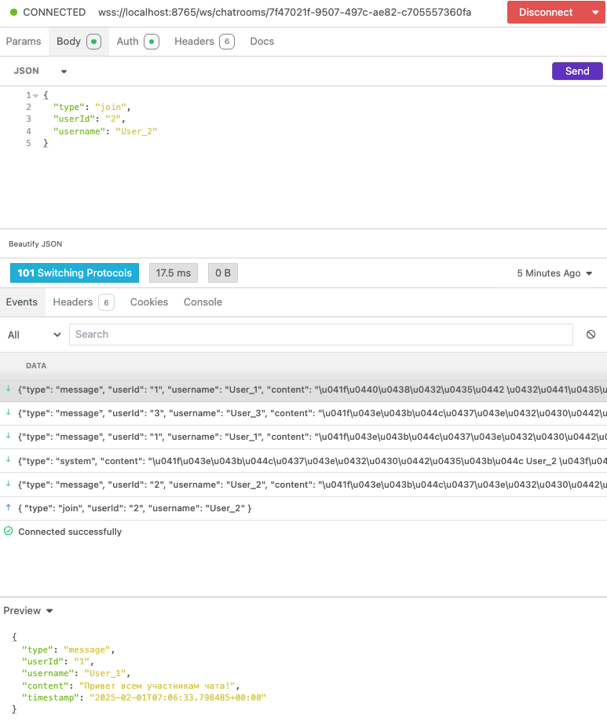

# chatroom_server
API chat room handler.

To get SSL certificate (certificate.crt) and a private key (private.key) to enable wss://

```commandline
openssl req -new -x509 -days 365 -nodes -out certificate.crt -keyout private.key
```

Swagger: Создание и просмотр чатов. Попытка интегрировать Websocket endpoints.

[]()

Создание чата:

[]()
[]()

Просмотр чатов:

[]()

Установка Websocket соединения:

[]()

Пользователи чата:

[]()

Сообщения о присоединении:

[]()

Пользователь покинул чат. Сообщение:

[]()
[]()

Сообщение для участников чата:

[]()
[]()

Изменение количества участников:

[]()

Остановка сервера с причиной остановки:

[]()

Логи:

[]()
[]()

Первые тесты:

[]()


